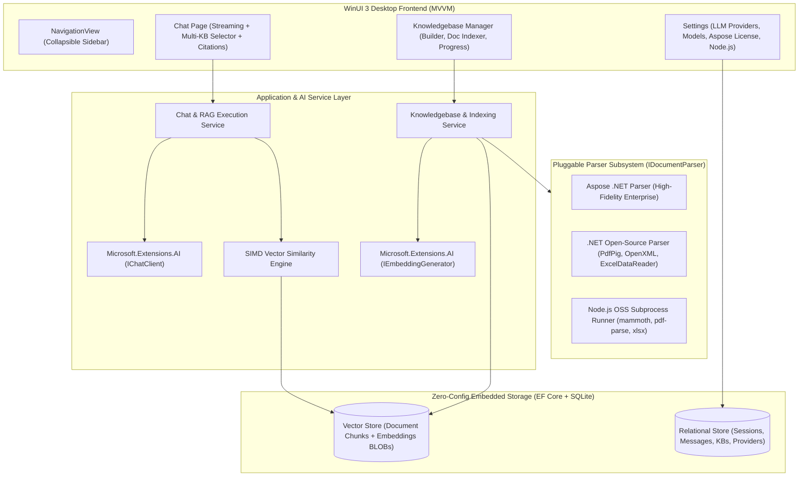
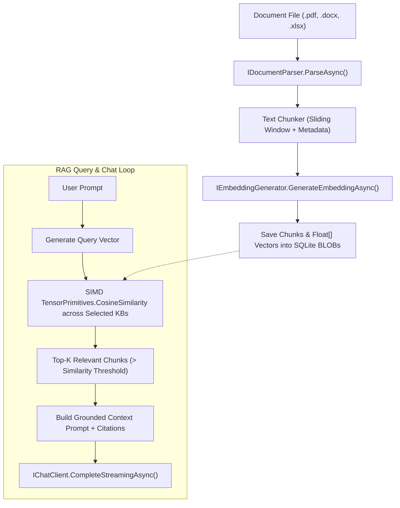
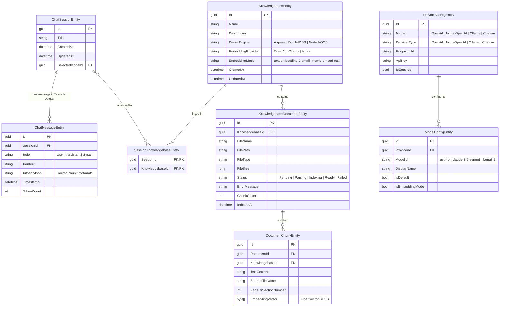

# FileFormat Studio - High-Level Architecture

> **Platform:** WinUI 3 (Windows App SDK) | .NET 10 (LTS)  
> **Ecosystem:** [FileFormat.ai](https://fileformat.ai) | Open-Source & Enterprise Desktop AI Knowledgebase

---

## 1. Executive Summary & Vision

**FileFormat Studio** is a native Windows desktop application built with **WinUI 3** and **.NET 10 (LTS)** that allows users to chat with their local documents (`.docx`, `.xlsx`, `.pptx`, `.pdf`, `.txt`, `.csv`, etc.) locally and natively on Windows.

### Core Architectural Pillars:
1. **Multi-Session Chat & Navigation:** Multi-turn conversational interface with dynamic session creation, history tracking, and deletion.
2. **Multi-Knowledgebase RAG:** Ability to attach one or more custom Knowledgebases (KBs) to any chat session for grounded document retrieval.
3. **Pluggable Document Parser Subsystem:** Flexible document extraction supporting **Paid Enterprise (.NET Aspose)**, **Free Native (.NET OSS)**, and **Free Ecosystem (Node.js OSS)**.
4. **Zero-Config Local Vector & Relational Storage:** Embedded **SQLite** database managed via **EF Core**, combined with hardware-accelerated **SIMD** vector similarity search (`System.Numerics.Tensors.TensorPrimitives`) requiring **zero external database installations**.
5. **Universal AI Layer:** Powered by **`Microsoft.Extensions.AI`** (`IChatClient` and `IEmbeddingGenerator`) supporting OpenAI, Azure OpenAI, Anthropic Claude, Google Gemini, and local models via Ollama.

---

## 2. High-Level System Architecture



---

## 3. Pluggable Document Parser Architecture

The application defines a unified, extensible parser contract (`IDocumentParser`) that isolates document extraction from the rest of the application.

```csharp
public interface IDocumentParser
{
    string EngineId { get; }      // "Aspose", "DotNetOSS", "NodeJsOSS"
    string DisplayName { get; }
    bool IsAvailable { get; }     // Checks if runtime/license requirements are met
    IReadOnlyList<string> SupportedExtensions { get; } // [".docx", ".xlsx", ".pptx", ".pdf", ".txt", ".csv"]
    
    Task<ParsedDocumentResult> ParseAsync(string filePath, CancellationToken ct = default);
}

public record ParsedDocumentResult(
    string RawText,
    List<DocumentSection> Sections, // Structured sections with page numbers, sheets, headers
    Dictionary<string, string> Metadata
);
```

### Parser Engine Implementations:

| Engine | Type | Underlying Libraries | Best For | Prerequisites |
| :--- | :--- | :--- | :--- | :--- |
| **Aspose Engine** | Paid / Enterprise .NET | `Aspose.Words`, `Aspose.Cells`, `Aspose.Slides`, `Aspose.PDF` | Pixel-perfect parsing, complex table structures, embedded objects. | Optional Aspose License in Settings (or Evaluation mode). |
| **.NET Open-Source** | Free / Native C# | `UglyToad.PdfPig` (PDF), `DocumentFormat.OpenXml` (Word/PPT), `ExcelDataReader` / `CsvHelper` (Excel/CSV) | Native in-process execution, zero external runtimes. | **None** (100% built-in). |
| **Node.js Open-Source** | Free / Node.js Ecosystem | `mammoth` (Word), `pdf-parse` (PDF), `xlsx` (Excel), `officeparser` | Leveraging rich Node.js document extraction ecosystem. | Local Node.js runtime installed or configured. |

#### Node.js Subprocess Runner Design:
For the Node.js parser, .NET launches a dedicated worker script via `System.Diagnostics.Process` with JSON IPC:
```
[ .NET FileFormat Studio ] ──(CLI / JSON Args)──> [ node parse-worker.js --input doc.docx ]
[ .NET FileFormat Studio ] <──(JSON Stdout)────── [ { text: "...", sections: [...] } ]
```

---

## 4. Zero-Config Local Vector Store & SIMD Search

To avoid requiring users to install separate vector databases (e.g. Qdrant, Milvus, Chroma), FileFormat Studio implements an **in-process SIMD vector store** using **SQLite + .NET 8 `TensorPrimitives`**.



### Vector Search Performance:
* Vectors (`float[]`) are serialized directly into SQLite `BLOB` columns.
* When querying, vectors for the selected Knowledgebase(s) are read into memory buffers and compared using hardware-accelerated SIMD instructions (`AVX2` / `AVX-512` via `System.Numerics.Tensors.TensorPrimitives.CosineSimilarity`).
* **Performance:** Comparing a query vector against 50,000 document chunks takes **< 10 milliseconds** on CPU without background services.

---

## 5. Relational Database Schema (EF Core + SQLite)

All state (sessions, messages, knowledgebases, document chunks, and provider settings) is stored in a single SQLite database file:  
`%LOCALAPPDATA%\FileFormatAIStudio\fileformat_studio.db`



---

## 6. WinUI 3 Modern Desktop UI Flow

```
┌────────────────────────────────────────────────────────────────────────────────────────────────────────┐
│  📁 FileFormat Studio                                                                           [-] [x]│
├──────────────────────┬─────────────────────────────────────────────────────────────────────────────────┤
│ [ ☰ ]                │ 💬 Chat with Documents                      [ Model: gpt-4o (OpenAI) ▼ ]         │
│                      │ Attached KBs: [ 📚 Q3 Reports ✕ ] [ 📚 Legal Docs ✕ ] [ ➕ Attach KB ]          │
│ [ ➕ New Chat ]      ├─────────────────────────────────────────────────────────────────────────────────┤
│                      │                                                                                 │
│ 💬 CHATS             │   ┌─────────────────────────────────────────────────────────────────────────┐   │
│ ┌──────────────────┐ │   │ 👤 User (10:15 AM)                                                      │   │
│ │📊 Q3 Financials  │ │   │ What were our gross margins according to the financial report?          │   │
│ │  (2 mins ago) [🗑]│ │   └─────────────────────────────────────────────────────────────────────────┘   │
│ ├──────────────────┤ │                                                                                 │
│ │📄 Legal Review   │ │   ┌─────────────────────────────────────────────────────────────────────────┐   │
│ │  (Yesterday)  [🗑]│ │   │ 🤖 Assistant (10:15 AM)                                                 │   │
│ └──────────────────┘ │   │ According to the Q3 report, gross margins were 64.2%, up 3.1% YoY.      │   │
│                      │   │                                                                         │   │
│ 📚 KNOWLEDGEBASES    │   │ 📄 Citations:                                                           │   │
│ • Q3 Financials      │   │ [1] Q3_Report.pdf (Page 4)  [2] Margin_Breakdown.xlsx (Sheet: Summary) │   │
│ • Legal Docs         │   └─────────────────────────────────────────────────────────────────────────┘   │
│ • HR Policies        │                                                                                 │
│                      ├─────────────────────────────────────────────────────────────────────────────────┤
│ ──────────────────── │ [ 📎 Attach File ] [ Type your message (Shift+Enter for newline)...       ] [➤] │
│ [ ⚙️ Settings ]      │ Status: Ready | 2 Knowledgebases Active                                         │
└──────────────────────┴─────────────────────────────────────────────────────────────────────────────────┘
```

### UI Components Breakdown:
1. **Collapsible Sidebar (`NavigationView`):**
   * **Chat Sessions List:** "+ New Chat" button, active session selection, session title editing, delete action (`🗑️`).
   * **Knowledgebase Library:** Navigate to KB manager, quick access to indexed KBs.
   * **Settings:** Quick footer navigation to global configuration.
2. **Chat Page (`ChatPage`):**
   * **Header Bar:** Active model selector dropdown and multi-select Knowledgebase tag chips.
   * **Message List:** Virtualized `ItemsRepeater` with user/assistant bubbles, Markdown text rendering (`CommunityToolkit.WinUI.Controls.Markdown`), and clickable citation references.
   * **Input Box:** Auto-expanding multiline text box with send (`Enter`) and cancel/stop generation button.
3. **Knowledgebase Manager Page (`KnowledgebasePage`):**
   * View all created KBs, total document count, indexed chunks, and parser used.
   * "+ Create Knowledgebase" modal with Parser Engine selector (Aspose, .NET OSS, Node.js OSS) and drag-and-drop document upload.
   * Real-time indexing progress bar (Parsing ➔ Chunking ➔ Embedding ➔ Stored).
4. **Settings Page (`SettingsPage`):**
   * **AI Providers & Models:** Add/edit API keys, endpoints, and model lists for OpenAI, Azure OpenAI, Ollama, etc.
   * **Aspose License:** Input license path / key for high-fidelity parser.
   * **Node.js Environment:** Configure custom Node.js path or auto-detect.
   * **Appearance:** Windows Mica backdrop, Dark / Light mode switching.

---

## 7. Project Directory Structure

```
fileformat-studio/
├── docs/
│   └── architecture.md                 # High-level architecture specification
├── FileFormatAIStudio/
│   ├── FileFormatAIStudio/
│   │   ├── App.xaml / App.xaml.cs       # Application root & Dependency Injection
│   │   ├── MainWindow.xaml / .cs        # Window shell with NavigationView
│   │   ├── Data/
│   │   │   ├── AppDbContext.cs          # EF Core SQLite Context
│   │   │   └── Entities/                # Database entities
│   │   ├── Services/
│   │   │   ├── AI/
│   │   │   │   ├── AIClientFactory.cs   # Microsoft.Extensions.AI client builder
│   │   │   │   └── RagChatService.cs    # Multi-turn RAG retrieval & streaming execution
│   │   │   ├── Knowledgebase/
│   │   │   │   ├── KnowledgebaseService.cs # KB & Document lifecycle management
│   │   │   │   ├── TextChunker.cs       # Token & sentence chunking
│   │   │   │   └── VectorStoreService.cs# SIMD TensorPrimitives cosine similarity search
│   │   │   ├── Parsers/
│   │   │   │   ├── IDocumentParser.cs   # Parser abstraction contract
│   │   │   │   ├── DocumentParserFactory.cs
│   │   │   │   ├── AsposeDocumentParser.cs    # Aspose Words, Cells, Slides, PDF
│   │   │   │   ├── DotNetOssDocumentParser.cs # PdfPig, OpenXML, ExcelDataReader
│   │   │   │   └── NodeJsDocumentParser.cs    # Node.js subprocess runner
│   │   │   └── Settings/
│   │   │       └── SettingsService.cs   # API Keys, Aspose License, Node.js path
│   │   ├── ViewModels/
│   │   │   ├── MainViewModel.cs         # Navigation & sidebar state
│   │   │   ├── ChatViewModel.cs         # Active chat, multi-KB selector, streaming
│   │   │   ├── KnowledgebaseViewModel.cs# KB creation, document upload & indexing
│   │   │   └── SettingsViewModel.cs     # Provider, model, license & path configs
│   │   └── Views/
│   │       ├── ChatPage.xaml / .cs
│   │       ├── KnowledgebasePage.xaml / .cs
│   │       └── SettingsPage.xaml / .cs
│   └── FileFormatAIStudio.slnx
├── readme.md
└── LICENSE
```

---

## 8. Summary of Technology Choices

| Area | Choice | Rationale |
| :--- | :--- | :--- |
| **Framework** | WinUI 3 (Windows App SDK) + .NET 10 (LTS) | Native Windows 11 Fluent UI, Mica backdrops, high-performance desktop execution. |
| **AI Abstraction** | `Microsoft.Extensions.AI` | Standardized Microsoft abstraction layer (`IChatClient`, `IEmbeddingGenerator`) for cloud & local LLMs. |
| **Relational DB** | SQLite via `Microsoft.EntityFrameworkCore.Sqlite` | Zero-configuration, serverless, single-file embedded DB. |
| **Vector DB** | SQLite BLOB + .NET 10 SIMD `TensorPrimitives` | 100% zero external installs, hardware-accelerated CPU search (<10ms for 50k chunks). |
| **Document Parsers** | Pluggable (`IDocumentParser`): Aspose + .NET OSS + Node.js OSS | Gives users the flexibility between 100% free open-source parsers and high-fidelity enterprise engines. |
| **MVVM Pattern** | `CommunityToolkit.Mvvm` | Fast source generators (`[ObservableProperty]`, `[RelayCommand]`), clean separation of concerns. |

