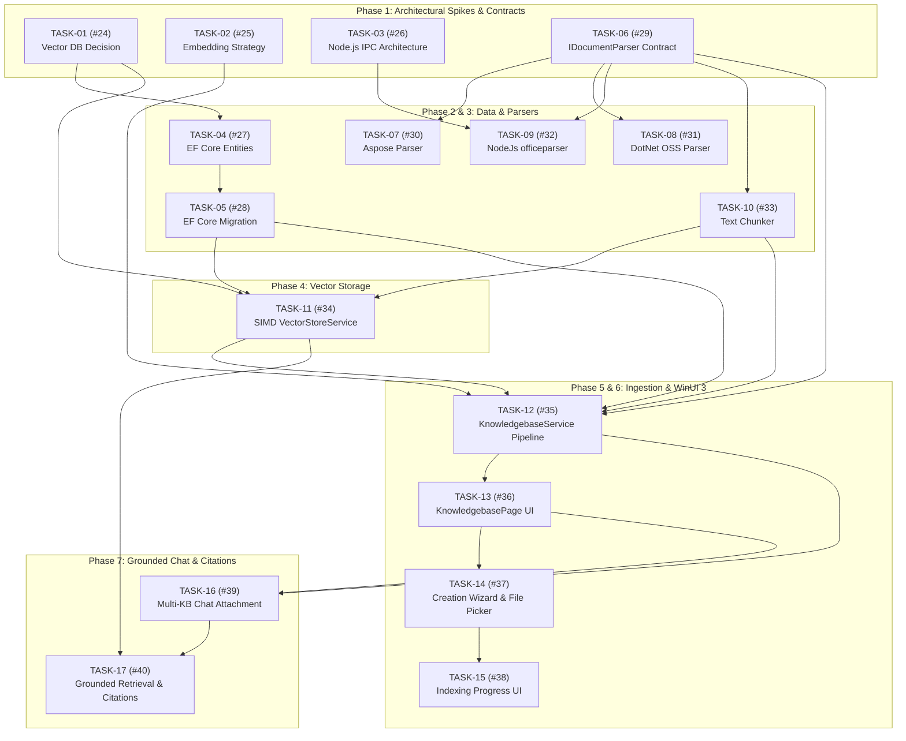

# Master Tasks Tracker: FileFormat AI Studio

> **Repository:** [OpenizePtyLtd/fileformat-studio](https://github.com/OpenizePtyLtd/fileformat-studio)  
> **Tracker Purpose:** Single source of truth for all granular engineering tasks, architectural spikes, and feature implementation across GitHub issues and project milestones.

---

## 1. Milestones Overview

| Milestone | Goal & Description | Target Deliverable |
| :--- | :--- | :--- |
| **M1: Document Parsing & Vector Engine Core** | Core architectural spikes, EF Core models, pluggable parsers (Aspose, DotNet OSS, Node.js officeparser), chunking, and in-process SIMD vector store. | Zero-config in-process parsing and vector similarity engine. |
| **M2: Knowledgebase Management & Ingestion UI** | Service orchestration, multi-file browsing, Knowledgebase manager and creation wizard UI with real-time indexing progress. | Full WinUI 3 Knowledgebase management workflow. |
| **M3: Multi-KB Chat Attachment & Grounded RAG** | Multi-knowledgebase attachment to chat sessions, grounded similarity retrieval, prompt augmentation, and source citations. | End-to-end multi-turn RAG chat with document citations. |

---

## 2. Master Tasks Matrix

| Task ID | Issue | Group / Phase | Task Title | Milestone | Prerequisites | Status |
| :---: | :---: | :--- | :--- | :--- | :--- | :---: |
| **TASK-01** | [#24](https://github.com/OpenizePtyLtd/fileformat-studio/issues/24) | 1. Architectural Decisions | `spike(rag): Evaluate & decide Vector DB engine (In-Process SQLite BLOB + SIMD vs sqlite-vec vs Embedded)` | M1 | None | ✅ Completed |
| **TASK-02** | [#25](https://github.com/OpenizePtyLtd/fileformat-studio/issues/25) | 1. Architectural Decisions | `spike(rag): Evaluate & decide Embedding Generation pipeline via Microsoft.Extensions.AI` | M1 | None | ⏳ Pending |
| **TASK-03** | [#26](https://github.com/OpenizePtyLtd/fileformat-studio/issues/26) | 1. Architectural Decisions | `spike(parser): Design Node.js IPC runner for officeparser / node scripts in WinUI 3` | M1 | None | ⏳ Pending |
| **TASK-04** | [#27](https://github.com/OpenizePtyLtd/fileformat-studio/issues/27) | 2. Data & Persistence | `feat(data): Implement Knowledgebase and Document Chunk EF Core Entities` | M1 | TASK-01 | ✅ Completed |
| **TASK-05** | [#28](https://github.com/OpenizePtyLtd/fileformat-studio/issues/28) | 2. Data & Persistence | `feat(data): Add EF Core migration for Knowledgebase & Vector schema` | M1 | TASK-04 | ✅ Completed |
| **TASK-06** | [#29](https://github.com/OpenizePtyLtd/fileformat-studio/issues/29) | 3. Parser Subsystem | `feat(parser): Implement IDocumentParser contract, metadata models, and DocumentParserFactory` | M1 | None | ✅ Completed |
| **TASK-07** | [#30](https://github.com/OpenizePtyLtd/fileformat-studio/issues/30) | 3. Parser Subsystem | `feat(parser): Implement AsposeDocumentParser (.NET Words, Cells, Slides, PDF)` | M1 | TASK-06 | ✅ Completed |
| **TASK-08** | [#31](https://github.com/OpenizePtyLtd/fileformat-studio/issues/31) | 3. Parser Subsystem | `feat(parser): Implement DotNetOssDocumentParser (OpenXML, PdfPig, ExcelDataReader)` | M1 | TASK-06 | ✅ Completed |
| **TASK-09** | [#32](https://github.com/OpenizePtyLtd/fileformat-studio/issues/32) | 3. Parser Subsystem | `feat(parser): Implement NodeJsDocumentParser runner with officeparser & JSON IPC` | M1 | TASK-03, TASK-06 | ⏳ Pending |
| **TASK-10** | [#33](https://github.com/OpenizePtyLtd/fileformat-studio/issues/33) | 4. Chunking & Vector Search | `feat(rag): Implement TextChunker with token window and overlap` | M1 | TASK-06 | ✅ Completed |
| **TASK-11** | [#34](https://github.com/OpenizePtyLtd/fileformat-studio/issues/34) | 4. Chunking & Vector Search | `feat(rag): Implement VectorStoreService with SIMD Cosine Similarity search` | M1 | TASK-01, TASK-05, TASK-10 | ⏳ Pending |
| **TASK-12** | [#35](https://github.com/OpenizePtyLtd/fileformat-studio/issues/35) | 5. Knowledgebase Services | `feat(service): Implement KnowledgebaseService & multi-file ingestion pipeline` | M2 | TASK-02, TASK-05, TASK-06, TASK-10, TASK-11 | ⏳ Pending |
| **TASK-13** | [#36](https://github.com/OpenizePtyLtd/fileformat-studio/issues/36) | 6. Knowledgebase UI | `feat(ui): Build KnowledgebasePage and KnowledgebaseViewModel` | M2 | TASK-12 | ⏳ Pending |
| **TASK-14** | [#37](https://github.com/OpenizePtyLtd/fileformat-studio/issues/37) | 6. Knowledgebase UI | `feat(ui): Build Knowledgebase Creation Wizard dialog with multi-file picker` | M2 | TASK-13 | ⏳ Pending |
| **TASK-15** | [#38](https://github.com/OpenizePtyLtd/fileformat-studio/issues/38) | 6. Knowledgebase UI | `feat(ui): Implement real-time indexing progress UI for Knowledgebase creation` | M2 | TASK-14 | ⏳ Pending |
| **TASK-16** | [#39](https://github.com/OpenizePtyLtd/fileformat-studio/issues/39) | 7. Multi-KB Chat & Citations | `feat(chat): Add Multi-KB selector chips to ChatPage and ChatViewModel` | M3 | TASK-12, TASK-13 | ⏳ Pending |
| **TASK-17** | [#40](https://github.com/OpenizePtyLtd/fileformat-studio/issues/40) | 7. Multi-KB Chat & Citations | `feat(rag): Implement Grounded RAG query pipeline and source citations UI` | M3 | TASK-11, TASK-16 | ⏳ Pending |

---

## 3. Execution Sequence & Dependency Graph

Follow the dependency flow below to know which task can be picked next without waiting on unresolved prerequisites:

---

## 4. Engineering & Commit Conventions

When working on any task from this tracker:

1. **Branch Naming**:
   - `feat/task-XX-<short-name>` (e.g. `feat/task-06-document-parser-contract`)
   - `spike/task-XX-<short-name>` (e.g. `spike/task-01-vector-db-eval`)
2. **Conventional Commits**:
   - `feat(parser): implement IDocumentParser contract and factory (#29)`
   - `feat(data): add KB and chunk entities (#27)`
   - `spike(rag): benchmark SQLite BLOB vs sqlite-vec (#24)`
   - `fix(chat): ...`
3. **Closing Issues**:
   - Reference the issue in PR descriptions and commit messages using `Resolves #XX` or `Closes #XX`.
4. **Updating the Tracker**:
   - Update the status icon in `docs/master_tasks.md` when starting (`🔄 In Progress`) and upon completion (`✅ Completed`).

